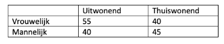

```{r, echo = FALSE, results = "hide"}
include_supplement("vufgb-oddsratio-003-nl-table01.jpg", recursive = TRUE)
```

Question
========
  
Een onderzoeker wil weten of er een verschil is tussen vrouwelijke studenten (groep 1) en mannelijke studenten (groep 2) in het aandeel uitwonende studenten. Bereken op basis van onderstaande tabel de **odds ratio** om dit verschil weer te geven.

Formule voor de odds ratio:

$\theta = \frac{\frac{\pi_{1}}{(1-\pi_{1})}}{\frac{\pi_{2}}{(1-\pi_{2})}}$


  
Answerlist
----------
* 1.23 
* 1.89 
* 1.55
* 1.37

Solution
========
  
Answerlist
----------
* Incorrect
* Incorrect
* Correct
* Incorrect

Meta-information
================
exname: vufgb-oddsratio-003-nl
extype: schoice
exsolution: 0010
exsection: Descriptive statistics/Summary Statistics/Odds ratio
exextra[ID]: 6e2bd
exextra[Type]: Calculation
exextra[Program]: 
exextra[Language]: Dutch
exextra[Level]: Statistical Thinking
