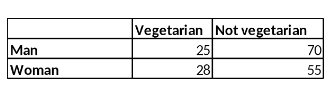

```{r, echo = FALSE, results = "hide"}
include_supplement("vufgb-oddsratio-004-en-table01.jpg", recursive = TRUE)
```

Question
========
  
A researcher would like to know whether there is a difference between men (group 1) and women (group 2) in the likelihood of being a vegetarian. Based on the table below, calculate the odds ratio indicating this difference.



Formula for the odds ratio:

$\theta = \frac{\frac{\pi_{1}}{(1-\pi_{1})}}{\frac{\pi_{2}}{(1-\pi_{2})}}$
  
Answerlist
----------
* 0.22 
* 0.30 
* 0.70
* 0.78

Solution
========

Answerlist
----------
* Incorrect
* Incorrect
* Correct
* Incorrect

Meta-information
================
exname: vufgb-oddsratio-004-en
extype: schoice
exsolution: 0010
exsection: Descriptive statistics/Summary Statistics/Odds ratio, Descriptive statistics/Data representation/Tables
exextra[ID]: 164a6
exextra[Type]: Calculation
exextra[Program]: 
exextra[Language]: English
exextra[Level]: Statistical Thinking
