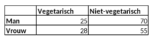

```{r, echo = FALSE, results = "hide"}
include_supplement("vufgb-oddsratio-004-nl-table01.jpg", recursive = TRUE)
```

Question
========
  
Een onderzoeker wil weten of er een verschil is tussen mannen (groep 1) en vrouwen (groep 2) in het al dan niet vegetarisch zijn. Bereken op basis van onderstaande tabel de **odds ratio** om dit verschil weer te geven.

Formule voor de odds ratio:

$\theta = \frac{\frac{\pi_{1}}{(1-\pi_{1})}}{\frac{\pi_{2}}{(1-\pi_{2})}}$




  
Answerlist
----------
* 0.22 
* 0.30 
* 0.70
* 0.78

Solution
========

Answerlist
----------
* Incorrect
* Incorrect
* Correct
* Incorrect

Meta-information
================
exname: vufgb-oddsratio-004-nl
extype: schoice
exsolution: 0010
exsection: Descriptive statistics/Summary Statistics/Odds ratio, Descriptive statistics/Data representation/Tables
exextra[ID]: 7e5a9
exextra[Type]: Calculation
exextra[Program]: 
exextra[Language]: Dutch
exextra[Level]: Statistical Thinking
