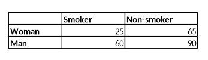

```{r, echo = FALSE, results = "hide"}
include_supplement("vufgb-oddsratio-005-en-table01.jpg", recursive = TRUE)
```

Question
========
  
A researcher would like to know whether there is a difference between young women (group 1) and young men (group 2) in the share of smokers. Based on the table below, calculate the odds ratio indicating this difference.



Formula for the odds ratio:

$\theta = \frac{\frac{\pi_{1}}{(1-\pi_{1})}}{\frac{\pi_{2}}{(1-\pi_{2})}}$
  
Answerlist
----------
* 0.28 
* 0.40 
* 0.58
* 0.69

Solution
========

Answerlist
----------
* Incorrect
* Incorrect
* Correct
* Incorrect

Meta-information
================
exname: vufgb-oddsratio-005-en
extype: schoice
exsolution: 0010
exsection: Descriptive statistics/Summary Statistics/Odds ratio, Descriptive statistics/Summary Statistics/Odds ratio
exextra[ID]: aea2b
exextra[Type]: Calculation
exextra[Program]: 
exextra[Language]: English
exextra[Level]: Statistical Thinking
