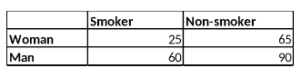

```{r, echo = FALSE, results = "hide"}
include_supplement("vufgb-oddsratio-005-nl-table01.jpg", recursive = TRUE)
```

Question
========
  
Een onderzoeker wil weten of er een verschil is tussen jongvolwassen vrouwen (groep 1) en jongvolwassen mannen (groep 2) in het aandeel rokers. Bereken op basis van onderstaande tabel de odds ratio om dit verschil weer te geven.



Formule voor de odds ratio:

$\theta = \frac{\frac{\pi_{1}}{(1-\pi_{1})}}{\frac{\pi_{2}}{(1-\pi_{2})}}$

Answerlist
----------
* 0.28 
* 0.40 
* 0.58
* 0.69

Solution
========

Answerlist
----------
* Incorrect
* Incorrect
* Correct
* Incorrect

Meta-information
================
exname: vufgb-oddsratio-005-nl
extype: schoice
exsolution: 0010
exsection: Descriptive statistics/Summary Statistics/Odds ratio, Descriptive statistics/Summary Statistics/Odds ratio
exextra[Type]: Calculation
exextra[Program]: 
exextra[Language]: Dutch
exextra[Level]: Statistical Thinking