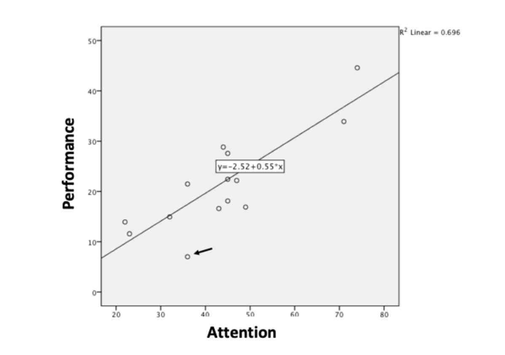

```{r, echo = FALSE, results = "hide"}
include_supplement("vufgb-scatterplot-001-en-graph-01.png", recursive = TRUE)
```
Question
========
  
A scatterplot with fitted regression line depicts the linear association between Attention and Performance. Study the observation indicated by the arrow and complete the following sentence. The residual of this observation is _____ and contributes relatively ___ to the residual sum of squares *SSE*. 



Answerlist
----------
* Positive ; Strongly.
* Positive ; Weakly.
* Negative ; Strongly.
* Negative ; Weakly.

Solution
========

Answerlist
----------
* Incorrect 
* Incorrect 
* Correct 
* Incorrect

Meta-information
================
exname: vufgb-scatterplot-001-en
extype: schoice
exsolution: 0010
exsection: Descriptive statistics/Data representation/Graphs/Scatterplot
exextra[Type]: Interpretating graph
exextra[Language]: English
exextra[Level]: Statistical Reasoning