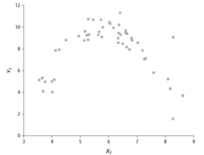

```{r, echo = FALSE, results = "hide"}
include_supplement("vufgb-scatterplot-001-nl.png", recursive = TRUE)
```

Question
========
Gegeven is onderstaande puntenwolk (‘scatterplot’). Deze geeft het verband tussen twee variabelen weer. 



Bepaal hoe groot de regressiecoëfficiënt *b* ongeveer zou zijn als een enkelvoudige lineaire regressieanalyse uitgevoerd zou worden.

Answerlist
----------
* ± 0.
* ± 0.5.
* ± 6.
* ± 11.


Solution
========

Answerlist
----------
* Incorrect
* Incorrect
* Correct
* Incorrect


Meta-information
================
exname: vufgb-scatterplot-001-nl
extype: schoice
exsolution: 0010
exsection: Descriptive statistics/Data representation/Graphs/Scatterplot, Inferential Statistics/Regression/Simple linear regression
exextra[Type]: Interpreting graph
exextra[Language]: Dutch
exextra[Level]: Statistical Thinking
