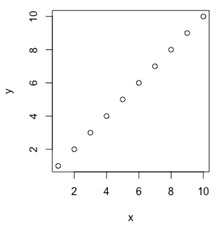

```{r, echo = FALSE, results = "hide"}
include_supplement("vufgb-scatterplot-002-nl.png", recursive = TRUE)
```

Question
========
Given is the point cloud below (*scatterplot*).



Which conclusion is correct?

Answerlist
----------
* He relationship between the variables is **negative**. The *SSE* is **0**.
* The relationship between the variables is **negative**. The *SSE* is **1**.
* The relationship between the variables is **positive**. The *SSE* is **0**.
* The relationship between the variables is **positive**. The *SSE* is **1**.


Solution
========

Answerlist
----------
* Incorrect
* Incorrect
* Correct
* Incorrect

Meta-information
================
exname: vufgb-scatterplot-002-en
extype: schoice
exsolution: 0010
exsection: Descriptive statistics/Data representation/Graphs/Scatterplot
exextra[Type]: Interpreting graph
exextra[Language]: English
exextra[Level]: Statistical Thinking
