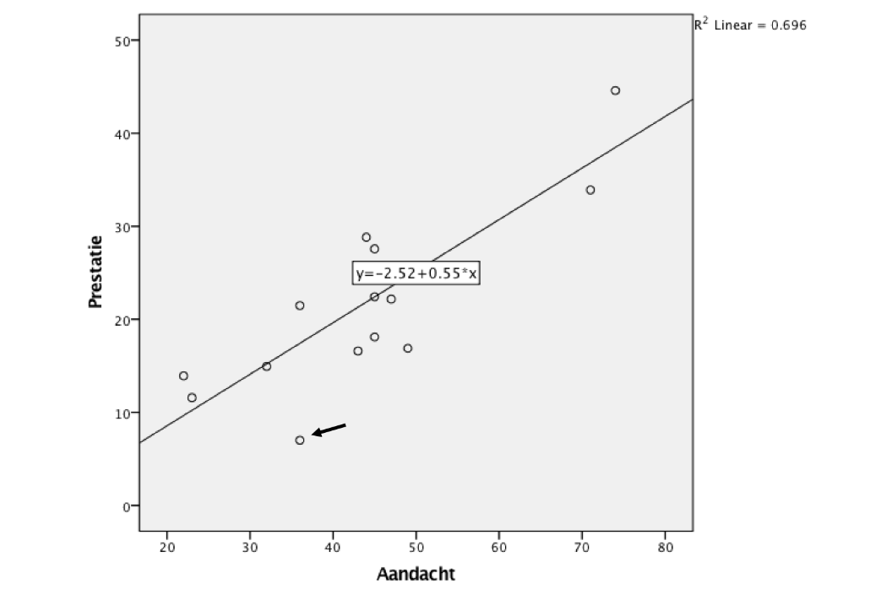

```{r, echo = FALSE, results = "hide"}
include_supplement("vufgb-scatterplot-003-nl-graph-01.png", recursive = TRUE)
```
Question
========
  
A point cloud ("scatterplot") with appropriate regression line shows the linear relationship between Attention and Performance. Examine the observation at the arrow and complete the following sentence. The residual of this observation is _____ and contributes relatively ___ to the residual quadratic sum *SSE*. 




Answerlist
----------
* Positive; Strong
* Positive; Weak
* Negative; Strong
* Negative; Weak

Solution
========

Answerlist
----------
* Incorrect
* Incorrect
* Correct
* Incorrect

Meta-information
================
exname: vufgb-scatterplot-003-en
extype: schoice
exsolution: 0010
exsection: Descriptive statistics/Data representation/Graphs/Scatterplot
exextra[Type]: Interpreting graph
exextra[Language]: English
exextra[Level]: Statistical Reasoning
