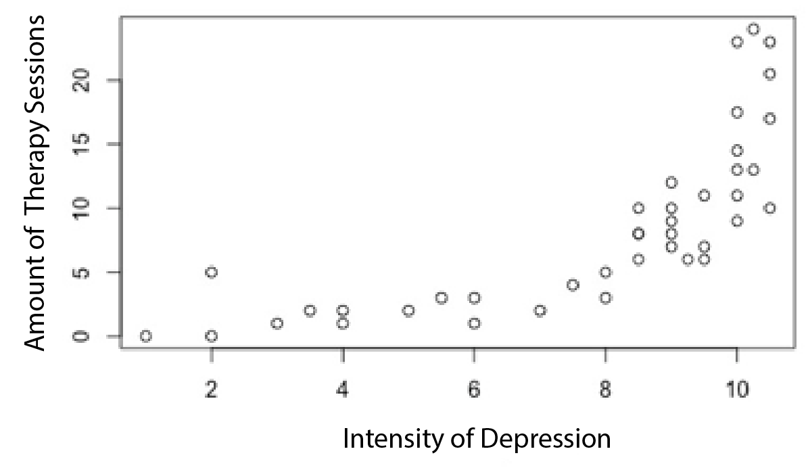

```{r, echo = FALSE, results = "hide"}
include_supplement("vufgb-scatterplot-005-en-scatterplot01.png", recursive = TRUE)
```

Question
========

Given is the following point cloud ('scatterplot').

Complete.

The relationship between the Severity of Depression and the Number of Therapy Sessions is ... and ... .


  
Answerlist
----------
* Negative; linear
* Positive; linear
* Negative; nonlinear
* Positive; nonlinear


Solution
========

Answerlist
----------
* Incorrect
* Incorrect
* Incorrect
* Correct

Meta-information
================
exname: vufgb-scatterplot-005-en
extype: schoice
exsolution: 0001
exsection: Descriptive statistics/Data representation/Graphs/Scatterplot
exextra[Type]: Interpreting graph
exextra[Program]: 
exextra[Language]: English
exextra[Level]: Statistical Literacy
