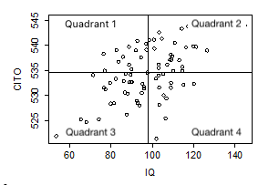

```{r, echo = FALSE, results = "hide"}
include_supplement("vufgb-scatterplot-006-en-scatterplot01.png", recursive = TRUE)
```

Question
========

Given is the scatterplot below.

Complete.

The cross products of the observations in the first quadrant are ... and the relationship between *IQ* and *CITO* is ... .


  
Answerlist
----------
* Negative; negative
* Negative; positive
* Positive; negative
* Positive; positive

Solution
========

Answerlist
----------
* Incorrect
* Correct
* Incorrect
* Incorrect

Meta-information
================
exname: vufgb-scatterplot-006-en
extype: schoice
exsolution: 0100
exsection: Descriptive statistics/Data representation/Graphs/Scatterplot
exextra[Type]: Interpreting graph
exextra[Program]: 
exextra[Language]: English
exextra[Level]: Statistical Literacy
