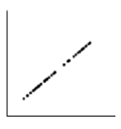

```{r, echo = FALSE, results = "hide"}
include_supplement("vufgb-scatterplot-007-nl-scatterplot01.jpg", recursive = TRUE)
```

Question
========

Given is the point cloud ('scatterplot') below.

Complete.

The correlation between the two variables is ... and the SSE is ... .


  
Answerlist
----------
* 0 ; 0
* 0 ; 1
* 1 ; 0
* 1 ; 1

Solution
========

Answerlist
----------
* Incorrect
* Incorrect
* Correct
* Incorrect

Meta-information
================
exname: vufgb-scatterplot-007-en
extype: schoice
exsolution: 0010
exsection: Descriptive statistics/Data representation/Graphs/Scatterplot, Descriptive statistics/Summary Statistics/Bivariate statistics/Correlation, Inferential Statistics/Regression/Sum of squares
exextra[Type]: Interpreting graph
exextra[Program]: 
exextra[Language]: English
exextra[Level]: Statistical Literacy
