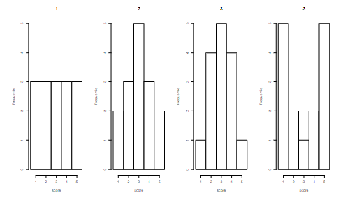

```{r, echo = FALSE, results = "hide"}
include_supplement("vufgb-standarddeviation-010-nl-histogram01.jpg", recursive = TRUE)
```

Question
========
  
Which of the following histograms has the smallest standard deviation?
  
  
  
Answerlist
----------
* 1
* 2
* 3
* 4

Solution
========

Answerlist
----------
* Incorrect
* Incorrect
* Correct
* Incorrect

Meta-information
================
exname: vufgb-standarddeviation-010-en
extype: schoice
exsolution: 0010
exsection: Descriptive statistics/Summary Statistics/Measures of Spread/Standard Deviation, Descriptive statistics/Data representation/Graphs/Histogram
exextra[ID]: c18ed
exextra[Type]: Interpreting graph
exextra[Program]: 
exextra[Language]: English
exextra[Level]: Statistical Literacy
