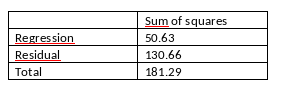

```{r, echo = FALSE, results = "hide"}
include_supplement("vufgb-standarddeviation-013-nl-table01.jpg", recursive = TRUE)
```

Question
========

Given below is selected SPSS output from a single regression analysis in 50 subjects. Calculate the conditional standard deviation *s*.



  
Answerlist
----------
* 2.72
* 2.67
* 1.65
* 1.63


Solution
========

Answerlist
----------
* Incorrect
* Incorrect
* Correct
* Incorrect

Meta-information
================
exname: vufgb-standarddeviation-013-en
extype: schoice
exsolution: 0010
exsection: Descriptive statistics/Summary Statistics/Measures of Spread/Standard Deviation, Descriptive statistics/Data representation/Tables
exextra[Type]: Calculation
exextra[Program]: 
exextra[Language]: English
exextra[Level]: Statistical Literacy
