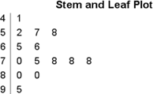

```{r, echo = FALSE, results = "hide"}
include_supplement("vufgb-stemandleafplot-001-nl.png", recursive = TRUE)
```

Question
========
Given is the following voice-and-leaf plot.



Which statement is TRUE? Complete this sentence: "The score most common is..."

Answerlist
----------
* 5.
* 8.
* 78.
* 56.

Meta-information
================
exname: vufgb-stemandleafplot-001-EN
extype: schoice
exsolution: 0010
exsection:Descriptive statistics/Data representation/Graphs/Stem and leaf plot
exextra[Type]: Calculation, Interpreting graph
exextra[Language]: Dutch
exextra[Level]: Statistical Thinking
