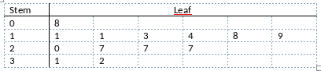

```{r, echo = FALSE, results = "hide"}
include_supplement("vufgb-stemandleafplot-002-nl-stemandleafplot01.jpg", recursive = TRUE)
```

Question
========

Given is the voice-and-leaf plot below. How many observations are there in the plot? 



  
Answerlist
----------
* 4
* 9
* 13
* 17

Solution
========

Answerlist
----------
* Incorrect
* Incorrect
* Correct
* Incorrect

Meta-information
================
exname: vufgb-stemandleafplot-002-en
extype: schoice
exsolution: 0010
exsection: Descriptive statistics/Data representation/Graphs/Stem and leaf plot
exextra[Type]: Interpreting graph
exextra[Program]: 
exextra[Language]: English
exextra[Level]: Statistical Literacy
