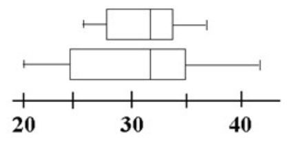

```{r, echo = FALSE, results = "hide"}
include_supplement("vufgb-summarystatistics-002-en-boxplot01.jpg", recursive = TRUE)
```

Question
========
  
Fill in the blanks:

The distribution of variables A (top) and B (Bottom) are shown in the **boxplots** below.

The spread of variable A is ..I.. the spread of variable B. the median of variable A is ..II.. the median of variable B.




Answerlist
----------
* I: equal to, II: equal to
* I: smaller than, II: equal to
* I: equal to, II: smaller than
* I: smaller than, II: smaller than
  
Solution
========
  
Answerlist
----------
* Incorrect
* Correct
* Incorrect
* Incorrect

Meta-information
================
exname: vufgb-summarystatistics-002-en
extype: schoice
exsolution: 0100
exsection: Descriptive statistics/Data representation/Graphs/Boxplot,Descriptive statistics/Summary Statistics/Measures of Spread, Descriptive statistics/Summary Statistics/Measures of Location/Median
exextra[Type]: Conceptual, Interpreting graph
exextra[Program]: 
exextra[Language]: English
exextra[Level]: Statistical Literacy
