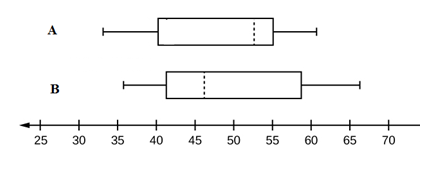

```{r, echo = FALSE, results = "hide"}
include_supplement("vufgb-summarystatistics-003-nl-boxplot01.jpg", recursive = TRUE)
```

Question
========
  
De verdeling van twee variabelen (A en B) wordt weergegeven door onderstaande **boxplots**. 

Het gemiddelde van variabele A ....I.... de mediaan. De verdeling van variabele B …..II……. 


  
Answerlist
----------
* I: valt samen met,  II: ligt scheef naar links
* I: ligt links van,  II: ligt scheef naar rechts
* I: valt samen met,  II: ligt scheef naar rechts
* I: ligt rechts van,   II: is symmetrisch. 


Solution
========

Answerlist
----------
* Incorrect
* Correct
* Incorrect
* Incorrect

Meta-information
================
exname: vufgb-summarystatistics-003-nl
extype: schoice
exsolution: 0100
exsection: Descriptive statistics/Summary Statistics, Descriptive statistics/Summary Statistics/Measures of Location/Mean, Descriptive statistics/Summary Statistics/Measures of Location/Median, Descriptive statistics/Summary Statistics/Measures of Spread, Descriptive statistics/Data representation/Graphs/Boxplot
exextra[Type]: Interpreting graph
exextra[Program]: 
exextra[Language]: Dutch
exextra[Level]: Statistical Thinking
