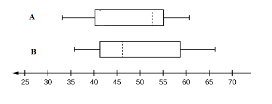

```{r, echo = FALSE, results = "hide"}
include_supplement("vufgb-summarystatistics-004-en-boxplot01.jpg", recursive = TRUE)
```

Question
========
  
Fill in the blanks: The distributions of two variables (A and B) are shown in the boxplots below. The mean for variable A will be to the  ...I... of the median. The distribution of variable B is skewed to the ...II... .



  
Answerlist
----------
* I: left,  II: left
* I: left,  II: right
* I: right,  II: left
* I: right,  II: right


Solution
========

Answerlist
----------
* Incorrect
* Correct
* Incorrect
* Incorrect

Meta-information
================
exname: vufgb-summarystatistics-004-en
extype: schoice
exsolution: 0100
exsection: Descriptive statistics/Summary Statistics, Descriptive statistics/Summary Statistics/Measures of Location/Mean, Descriptive statistics/Summary Statistics/Measures of Location/Median, Descriptive statistics/Summary Statistics/Measures of Spread, Descriptive statistics/Data representation/Graphs/Boxplot
exextra[ID]: f7282
exextra[Type]: Interpreting graph
exextra[Program]: 
exextra[Language]: English
exextra[Level]: Statistical Literacy
