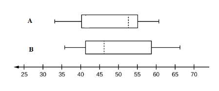

```{r, echo = FALSE, results = "hide"}
include_supplement("vufgb-summarystatistics-004-nl-boxplot01.jpg", recursive = TRUE)
```

Question
========
  
Vul in:

De verdeling van twee variabelen (A en B) wordt weergegeven door onderstaande box-plots. 

Het gemiddelde van variabele A ligt ...I... van de mediaan. De verdeling van variabele B ligt scheef naar ...II... . 


  
Answerlist
----------
* I: links,   II: links
* I: rechts,  II: links
* I: links,   II: rechts 
* I: rechts,  II: rechts


Solution
========

Answerlist
----------
* Incorrect
* Incorrect
* Correct
* Incorrect

Meta-information
================
exname: vufgb-summarystatistics-004-nl
extype: schoice
exsolution: 0010
exsection: Descriptive statistics/Summary Statistics, Descriptive statistics/Summary Statistics/Measures of Location/Mean, Descriptive statistics/Summary Statistics/Measures of Location/Median, Descriptive statistics/Summary Statistics/Measures of Spread, Descriptive statistics/Data representation/Graphs/Boxplot
exextra[Type]: Interpreting graph
exextra[Program]: 
exextra[Language]: Dutch
exextra[Level]: Statistical Literacy