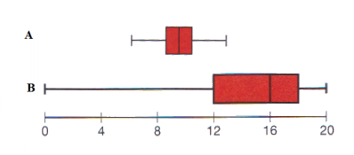

```{r, echo = FALSE, results = "hide"}
include_supplement("vufgb-summarystatistics-005-en-boxplot01.jpg", recursive = TRUE)
```

Question
========
  
Fill in the blanks: The distributions of two variables (A and B) are shown in the boxplots below. The mean for variable A will be …....I……. the median. The distribution of variable B …..II…… .


  
Answerlist
----------
* I: equal to,  II: is skewed to the left
* I: to the left of,  II: is skewed to the right
* I: equal to,  II: is skewed to the right
* I: to the right of, II: is symmetric


Solution
========

Answerlist
----------
* Correct
* Incorrect
* Incorrect
* Incorrect

Meta-information
================
exname: vufgb-summarystatistics-005-en
extype: schoice
exsolution: 1000
exsection: Descriptive statistics/Summary Statistics, Descriptive statistics/Summary Statistics/Measures of Location/Mean, Descriptive statistics/Summary Statistics/Measures of Location/Median, Descriptive statistics/Summary Statistics/Measures of Spread, Descriptive statistics/Data representation/Graphs/Boxplot
exextra[Type]: Interpretating graph
exextra[Program]: 
exextra[Language]: English
exextra[Level]: Statistical Thinking