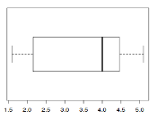

```{r, echo = FALSE, results = "hide"}
include_supplement("vufgb-summarystatistics-005-nl-boxplot01.jpg", recursive = TRUE)
```


Question
========
  
De verdeling van een variabele wordt weergegeven door onderstaande box-plot. Het gemiddelde ligt …....I……. van de mediaan, en de verdeling is scheef naar …..II…… .


  
Answerlist
----------
* I: links, II: links
* I: links, II: rechts
* I: rechts, II: links
* I: rechts, II: rechts


Solution
========

Answerlist
----------
* Correct
* Incorrect
* Incorrect
* Incorrect

Meta-information
================
exname: vufgb-summarystatistics-005-nl
extype: schoice
exsolution: 1000
exsection: Descriptive statistics/Summary Statistics, Descriptive statistics/Summary Statistics/Measures of Location/Mean, Descriptive statistics/Summary Statistics/Measures of Location/Median, Descriptive statistics/Data representation/Graphs/Boxplot
exextra[Type]: Conceptual, Interpreting graph
exextra[Program]: 
exextra[Language]: Dutch
exextra[Level]: Statistical Literacy
