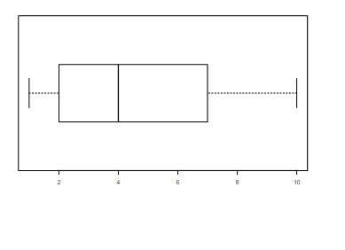

```{r, echo = FALSE, results = "hide"}
include_supplement("vufgb-summarystatistics-009-nl-boxplot01.jpg", recursive = TRUE)
```

Question
========

Given is the boxplot below.

Complete the corresponding statements.

The middle observation is ... and the interquartile range is ... .


  
Answerlist
----------
* 5 and 5
* 4 and 5
* 5 and 9
* 4 and 9

Solution
========

Answerlist
----------
* Incorrect
* Correct
* Incorrect
* Incorrect

Meta-information
================
exname: vufgb-summarystatistics-009-en
extype: schoice
exsolution: 0100
exsection: Descriptive statistics/Summary Statistics, Descriptive statistics/Summary Statistics/Measures of Location/Median, Descriptive statistics/Summary Statistics/Measures of Spread/Interquartile Range, Descriptive statistics/Data representation/Graphs/Boxplot
exextra[Type]: Interpreting graph, Conceptual
exextra[Program]: 
exextra[Language]: English
exextra[Level]: Statistical Literacy
