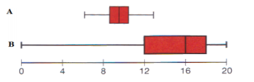

```{r, echo = FALSE, results = "hide"}
include_supplement("vufgb-summarystatistics-010-nl-boxplot01.jpg", recursive = TRUE)
```

Question
========

The distribution of two variables (A and B) is represented by the boxplots below.

The mean of variable A ....I.... is the median.

The distribution of variable B is ...II.... 


  
Answerlist
----------
* I: coincides with, II: skews to the left.
* I: lies to the left of, II: skews to the right.
* I: coincides with, II: skews to right.
* I: lies to the right of, II: is symmetrical.

Solution
========

Answerlist
----------
* Correct
* Incorrect
* Incorrect
* Incorrect

Meta-information
================
exname: vufgb-summarystatistics-010-en
extype: schoice
exsolution: 1000
exsection: Descriptive statistics/Summary Statistics, Descriptive statistics/Summary Statistics/Measures of Location/Mean, Descriptive statistics/Summary Statistics/Measures of Location/Median, Descriptive statistics/Data representation/Graphs/Boxplot
exextra[Type]: Interpreting graph, Conceptual
exextra[Program]: 
exextra[Language]: English
exextra[Level]: Statistical Literacy
