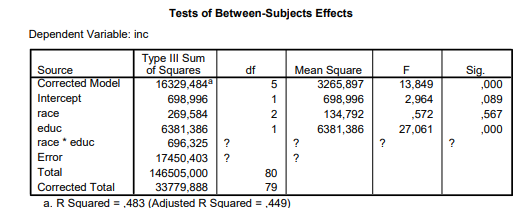

```{r, echo = FALSE, results = "hide"}
include_supplement("vufgb-variance-002-nl-table01.jpg", recursive = TRUE)
```

Question
========
  
See table below. A study examined differences in income among three ethnic groups in the United States (N = 80). The independent variable race had three levels: 1) White, 2) Hispanic and 3) Black. The dependent variable is income (inc), and years of education (educ) is used as a covariate. Given is the following output from a GLM.


  
Tips:

- In ANCOVA, the number of degrees of freedom for a covariate equals 1.

- In an ANCOVA with an interaction between covariate and factor, the number of degrees of freedom for the Error equals n - 2 × g.

- The degrees of freedom for the interaction are equal to the product of the degrees of freedom of Covariate and Factor.

- For a true ANCOVA, the number of degrees of freedom for the Error is equal to n - g - 1.

The variance of the dependent variable inc falls in the interval:

Answerlist
----------
* [300, 350]
* [350, 400]
* [400, 450]
* [450, 500]


Solution
========

Answerlist
----------
* Incorrect
* Incorrect
* Incorrect
* Correct

Meta-information
================
exname: vufgb-variance-002-en
extype: schoice
exsolution: 0100
exsection: Descriptive statistics/Summary Statistics/Measures of Spread/Variance
exextra[ID]: 1ced7
exextra[Type]: Calculation, Interpreting output
exextra[Program]: 
exextra[Language]: English
exextra[Level]: Statistical Thinking
