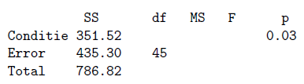

```{r, echo = FALSE, results = "hide"}
include_supplement("vufgb-variance-007-nl-table01.jpg", recursive = TRUE)
```

Question
========

In a study of memorization of verbal material as a function of level of information processing, five experimental conditions were: Counting, Rhyming, Adjective, Imagery and Intentional, with 10 observations each (N = 50). To test differences in the average number of words memorized, ANOVA was performed resulting in the partial results below:


  
How big is the *F* statistic?  
  
Answerlist
----------
* 3.92
* 4.12
* 9.08
* 8.79

Solution
========

Answerlist
----------
* Incorrect
* Incorrect
* Incorrect
* Correct

Meta-information
================
exname: vufgb-variance-007-en
extype: schoice
exsolution: 0001
exsection: Descriptive statistics/Summary Statistics/Measures of Spread/Variance
exextra[Type]: Interpreting output, Calculation
exextra[Program]: 
exextra[Language]: English
exextra[Level]: Statistical Thinking
