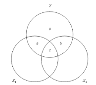

```{r, echo = FALSE, results = "hide"}
include_supplement("vufgb-venndiagram-001-nl-venndiagram01.jpg", recursive = TRUE)
```

Question
========

Below is a Venn diagram belonging to a multiple regression analysis. What is represented by plane a?


  
Answerlist
----------
* The total proportion of variance explained in $Y$ by $X_{1}$.
* The overlapping variance between $X_{1}$ and $X_{2}$.
* The proportion of explained variance in $Y$ by $X_{1}$, controlled by $X_{2}$.
* The proportion of variance explained in $Y$ by $X_{2}$, checked by $X_{1}$.

Solution
========

Answerlist
----------
* Incorrect
* Incorrect
* Correct
* Incorrect

Meta-information
================
exname: vufgb-venndiagram-001-en
extype: schoice
exsolution: 0010
exsection: Descriptive statistics/Data representation/Graphs/Venn diagram, Inferential Statistics/Regression/Multiple linear regression
exextra[ID]: 2b929
exextra[Type]: Interpreting graph, Conceptual
exextra[Program]: 
exextra[Language]: English
exextra[Level]: Statistical Literacy
