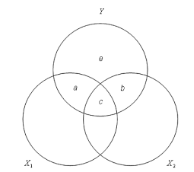

```{r, echo = FALSE, results = "hide"}
include_supplement("vufgb-venndiagram-001-nl-venndiagram01.jpg", recursive = TRUE)
```

Question
========

Hieronder zie je een Venn diagram dat hoort bij een meervoudige regressieanalyse. Wat wordt weergegeven met vlak a?


  
Answerlist
----------
* De totale proportie verklaarde variantie in $Y$ door $X_{1}$.
* De overlappende variantie tussen $X_{1}$ en $X_{2}$.
* De proportie verklaarde variantie in $Y$ door $X_{1}$, gecontroleerd door $X_{2}$.
* De proportie verklaarde variantie in $Y$ door $X_{2}$, gecontroleerd door $X_{1}$.

Solution
========

Answerlist
----------
* Incorrect
* Incorrect
* Correct
* Incorrect

Meta-information
================
exname: vufgb-venndiagram-001-nl
extype: schoice
exsolution: 0010
exsection: Descriptive statistics/Data representation/Graphs/Venn diagram, Inferential Statistics/Regression/Multiple linear regression
exextra[Type]: Interpreting graph, Conceptual
exextra[Program]: 
exextra[Language]: Dutch
exextra[Level]: Statistical Literacy
