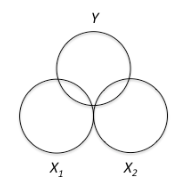

```{r, echo = FALSE, results = "hide"}
include_supplement("vufgb-venndiagram-002-nl-venndiagram01.jpg", recursive = TRUE)
```

Question
========

Given is the Venn diagram below that belongs to a multiple regression analysis. 



Which statement about the Venn diagram is TRUE?

Answerlist
----------
* There is multicollinearity.
* There is homogeneity.
* There is independent predictors.
* There is high explained variance.

Solution
========

Answerlist
----------
* Incorrect
* Incorrect
* Correct
* Incorrect

Meta-information
================
exname: vufgb-venndiagram-002-en
extype: schoice
exsolution: 0010
exsection: Descriptive statistics/Data representation/Graphs/Venn diagram, Inferential Statistics/Regression/Multiple linear regression
exextra[ID]: 692e1
exextra[Type]: Interpreting graph
exextra[Program]: 
exextra[Language]: English
exextra[Level]: Statistical Literacy
