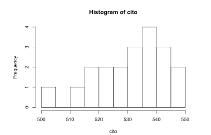

```{r, echo = FALSE, results = "hide"}
include_supplement("vufgb-zscore-023-nl-histogram01.jpg", recursive = TRUE)
```

Question
========

The histogram below shows the frequency distribution of the CITO scores of 20 grade eight students. The mean in this sample is 531, with a standard deviation of 12.92. The national average is 535. 



What percentage of students score below the national average? 
Answerlist
----------
* 11%
* 40%
* 50%
* 55%

Solution
========

Answerlist
----------
* Incorrect
* Incorrect
* Incorrect
* Correct

Meta-information
================
exname: vufgb-zscore-023-en
extype: schoice
exsolution: 0001
exsection: Descriptive statistics/Score interpretation/z-score, Descriptive statistics/Data representation/Graphs/Histogram
exextra[Type]: Calculation, Interpreting graph
exextra[Program]: 
exextra[Language]: English
exextra[Level]: Statistical Literacy
