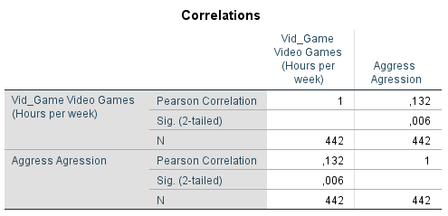

```{r, echo = FALSE, results = "hide"}
include_supplement("1605610297110.png", recursive = TRUE)
include_supplement("1605610532984.png", recursive = TRUE)
include_supplement("1605610556019.png", recursive = TRUE)
```

Question
========
Field aims to examine the relationship between the playing of violent video games by adolescents, aggressive behavior, and insensitivity, or the having emotionless traits, such as lack of guilt and empathy.  
  
He collected data on the time adolescents spend playing of video games (Vid\_game: number of hours per week spent playing of video games), aggressive behavior (Aggress: continuous scale 9-82) and whether youth scored below or above average on insensitivity and emotionless traits (Caunts_d: below average = 0; above average = 1). average = 1).  
  
Below are the results of a correlation analysis in which first the correlation between aggressive behavior and time spent playing violent video games is shown for the whole group. Then two separate correlation analyses were done for youths who scored below-average and those scoring above-average on insensitivity and emotionless traits .  
  

  
  
  
Caunts_d = 0:  

  
  
Caunts_d = 1:  

  
Based on these results, what statements can we make for this sample?  
  
1: Among those who score above average on insensitivity and emotionless traits, there is a stronger positive relationship between the degree of playing violent video games and aggressive behavior than among those who score below average on insensitivity and emotionless traits.  
2: Among those who score below average on insensitivity and emotionless traits, playing violent video games is is negatively associated with aggressive behavior.

Answerlist
----------
* Only statement 1
* Only statement 2
* Both statements
* Neither statement

Solution
========

Answerlist
----------
* False
* False
* True
* False

Meta-information
================
exname: vufsw-correlation-1292-en
extype: schoice
exsolution: 0010
exshuffle: TRUE
exsection: descriptive statistics/summary statistics/bivariate statistics/correlation
exextra[Type]: interpreting output
exextra[Program]: NA
exextra[Language]: English
exextra[Level]: statistical reasoning

