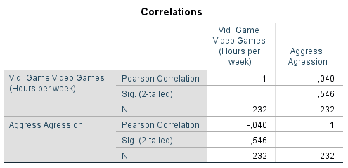

```{r, echo = FALSE, results = "hide"}
include_supplement("1605610297110.png")
include_supplement("1605610532984.png")
include_supplement("1605610556019.png")
```

Question
========
Field wil de relatie onderzoeken tussen het spelen van gewelddadige
videogames door jongeren, agressief gedrag, en ongevoeligheid ofwel het
hebben van emotieloze eigenschappen, zoals gebrek aan schuldgevoel en
empathie.  
  
Hij verzamelde data over de tijd die jongeren besteden aan het spelen
van video games (Vid\_game: aantal uren per week besteed aan het spelen
van video games), agressief gedrag (Aggress: continue schaal 9-82) en of
de jongeren onder- of bovengemiddeld scoren op ongevoeligheid en
emotieloze eigenschappen (Caunts\_d: onder het gemiddelde = 0; boven het
gemiddelde = 1).  
  
Hieronder staan de resultaten van een correlatieanalyse waarin eerst de
correlatie tussen agressief gedrag en de bestede tijd aan het spelen van
gewelddadige video games voor de hele groep is weergegeven. Vervolgens
zijn twee afzonderlijke correlatieanalyses gedaan voor jongeren die
onder- en die bovengemiddeld scoren op ongevoeligheid en emotieloze
eigenschappen .  
  
  
  
  
  
Caunts\_d = 0:  
  
  
  
Caunts\_d = 1:  
  
  
Welke uitspraken kunnen we op basis van deze uitkomsten doen voor deze
steekproef?  
  
1: Onder degenen die bovengemiddeld scoren op ongevoeligheid en
emotieloze eigenschappen is er een sterker positieve relatie tussen de
mate van spelen van gewelddadige video games en agressief gedrag dan
onder degenen die ondergemiddeld scoren op ongevoeligheid en emotieloze
eigenschappen.  
2: Onder degenen die ondergemiddeld scoren op ongevoeligheid en
emotieloze eigenschappen hangt het spelen van gewelddadige video games
negatief samen met agressief gedrag.

Answerlist
----------
* Alleen uitspraak 1
* Alleen uitspraak 2
* Beide uitspraken
* Geen van beide uitspraken

Solution
========


Answerlist
----------
* False
* False
* True
* False

Meta-information
================
exname: vufsw-correlation-1292-nl
extype: schoice
exsolution: 0010
exshuffle: TRUE
exsection: descriptive statistics/summary statistics/bivariate statistics/correlation
exextra[Type]: interpreting output
exextra[Program]: NA
exextra[Language]: Dutch
exextra[Level]: statistical reasoning

