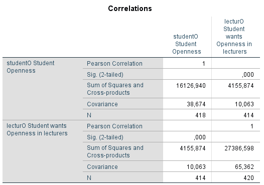

```{r, echo = FALSE, results = "hide"}
include_supplement("1605616634166.png", recursive = TRUE)
include_supplement("1602856133971.png", recursive = TRUE)
```

Question
========


  
Missing from the above covariance/correlation matrix is the correlation between the degree to which a student scores high on the personality trait "Openness" (StudentO: openness) and the desired degree of openness among his teachers (LecturO). The example is taken from a study by Chamorro-Premuzic, described in Field (*Discovering statistics using IBM SPSS statistics*, 2018) p. 365.  
  
What is the correlation? *Give a number in two decimal places, nothing else.*


Solution
========

Meta-information
================
exname: vufsw-correlation-1294-en
extype: string
exsolution: solution
exsection: descriptive statistics/summary statistics/bivariate statistics/correlation
exextra[Type]: calculation
exextra[Program]: calculator
exextra[Language]: English
exextra[Level]: statistical literacy

