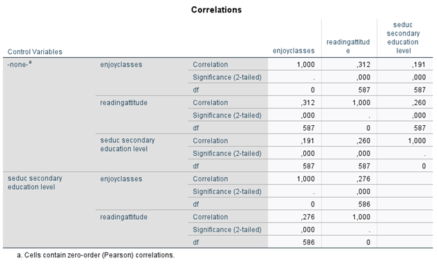

```{r, echo = FALSE, results = "hide"}
include_supplement("1631180947037.png")
```

Question
========
The partial correlation matrix below, including bivariate correlations
as well, examines the relationship - among young adults - between the
extent to which they used to enjoy literature classes in school and
their attitude toward reading now. The lower half of the table controls
this relationship for the variable school level.  
  

  
  
How large is the causal\* relation between the extent to which these
young adults enjoyed literature classes in school and their attitudes
toward reading? *Give a number in three decimal places.*  
*<sub>\*that\ is,\ the\ one\ that\ you\ can\ with\ most\ certainty\ interpret\ as\ causal</sub>*


Solution
========


Meta-information
================
exname: vufsw-correlation-1334-en
extype: num
exsolution: 0.276
extol: 0
exsection: descriptive statistics/summary statistics/bivariate statistics/correlation
exextra[Type]: interpreting output
exextra[Program]: NA
exextra[Language]: English
exextra[Level]: statistical literacy

