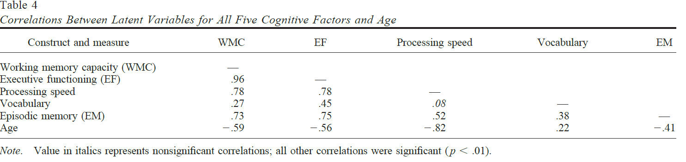

```{r, echo = FALSE, results = "hide"}
include_supplement("1631183026813.png", recursive = TRUE)
```

Question
========

  
  
Bekijk de bovenstaande tabel uit McCabe et al. (2010) met de correlaties
tussen de leeftijd (Age: gemeten in jaren) en vijf cognitieve factoren
(gemeten van laag naar hoog). Bekijk nu de twee stellingen hieronder en
kies het juiste antwoord.  
  

1.  Oudere respondenten scoren hoger op factor “Vocabulary”. 
2.  Jongere respondenten scoren lager op “Episodic Memory” (EM). 

Answerlist
----------
* Alleen stelling 1 is correct
* Alleen stelling 2 is correct
* Beide stellingen zijn correct
* Geen van beide stellingen is correct

Solution
========


Answerlist
----------
* True
* False
* False
* False

Meta-information
================
exname: vufsw-correlation-1338-nl
extype: schoice
exsolution: 1000
exshuffle: TRUE
exsection: descriptive statistics/summary statistics/bivariate statistics/correlation
exextra[Type]: interpreting output
exextra[Program]: NA
exextra[Language]: Dutch
exextra[Level]: statistical literacy

