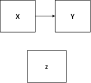

```{r, echo = FALSE, results = "hide"}
include_supplement("1602949639107.png", recursive = TRUE)
include_supplement("1602949826313.png", recursive = TRUE)
include_supplement("1602949868065.png", recursive = TRUE)
include_supplement("1602949886975.png", recursive = TRUE)
include_supplement("1602949911308.png", recursive = TRUE)
```

Question
========
Some whatsapp users can no longer leave their whatsapp alone leave it alone; with them it has become compulsive (compulsive) behavior. This is possibly related to the feeling not to miss anything, or the 'fear-of-missing-out' (FOMO). The database of Esam, Groot, Smits and Verhelst (2016) was collected to investigate this relationship. The data were collected via an online survey of 204 respondents.  
  
In the partial correlation matrix below, including zero-order correlations, we examined whether there is a relationship between compulsive Whatsapp use and "fear-of-missing-out" and whether this relationship changes when holding the influence of education level constant. There is Y = COMPULSIVE (a higher score means more compulsive Whatsapp use), X = FOMO (a higher score means a stronger sense of 'fear-of-missing-out'), and the third variable is EDUCATION (level of education: a higher score means a higher level of education).  
  

  
If you round the correlations to two decimal places, which causal model is then apply to the results of the analysis?

Answerlist
----------
* 
* 
* 
* 

Solution
========

Answerlist
----------
* True
* False
* False
* False

Meta-information
================
exname: vufsw-correlation-1352-en
extype: schoice
exsolution: 1000
exshuffle: TRUE
exsection: descriptive statistics/summary statistics/bivariate statistics/correlation
exextra[ID]: 95d7f
exextra[Type]: interpreting output
exextra[Program]: NA
exextra[Language]: English
exextra[Level]: statistical thinking

