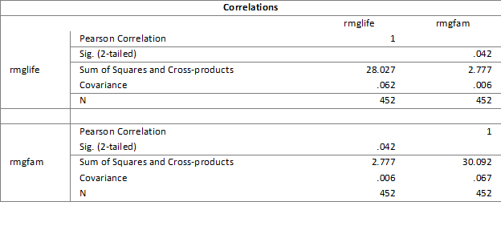

```{r, echo = FALSE, results = "hide"}
include_supplement("1598532290271.png", recursive = TRUE)
```

Question
========
Hieronder zie je een matrix met de correlatie tussen rgmlife en rgmfam. Rgmlife = het lezen van lifestylemagazines, zoals Cosmopolitan. Rmgfam = het lezen van familietijdschriften, zoals Panorama.  
  

Bereken met behulp van de gegevens in de bovenstaande correlatiematrix de correlatie tussen rmglife en rmgfam.

Answerlist
----------
* 0.006
* 0.431
* 1.444
* .093

Solution
========

= .006 /((wortel(.062))*(wortel(.067)) = .093

Answerlist
----------
* Onwaar
* Onwaar
* Onwaar
* Waar

Meta-information
================
exname: vufsw-correlation-2000-nl
extype: schoice
exsolution: 0001
exshuffle: TRUE
exsection: descriptive statistics/summary statistics/bivariate statistics/correlation
exextra[Type]: interpreting output
exextra[Program]: calculator
exextra[Language]: Dutch
exextra[Level]: statistical thinking

