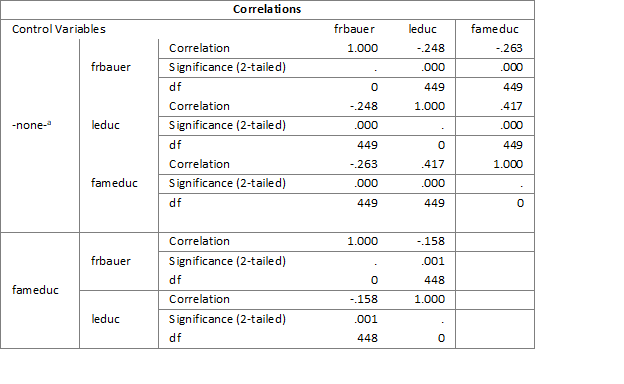

```{r, echo = FALSE, results = "hide"}
include_supplement("1598533294658.png", recursive = TRUE)
```

Question
========

  
In de bovenstaande partiële correlatiematrix, inclusief nul-orde correlaties, Y = frbauer (voorkeur voor Nederlandse muziek zoals van Frans Bauer), X = leduc (opleidingsniveau), en Z = fameduc (opleiding van ouders).  
  
Hoe moeten we de correlatie van -.248 tussen Frans Bauers muziekvoorkeur en opleidingsniveau?  
   
1: Hoe hoger de opleiding, hoe zwakker de muziekvoorkeur van Frans Bauer 2: Hoe lager de opleiding, hoe sterker de voorkeur voor muziek van Frans Bauer

Antwoordenlijst
----------
* Stelling 1 is juist.
* Alleen Stelling 2 is juist
* Beide Stellingen zijn juist
* Beide Stellingen zijn onjuist

Solution
========

Answerlist
----------
* Onwaar
* Onwaar
* Waar
* Onwaar

Meta-information
================
exname: vufsw-correlation-2033-nl
extype: schoice
exsolution: 0010
exshuffle: TRUE
exsection: descriptive statistics/summary statistics/bivariate statistics/correlation
exextra[ID]: ae6ff
exextra[Type]: interpreting output
exextra[Program]: NA
exextra[Language]: Dutch
exextra[Level]: statistical literacy

