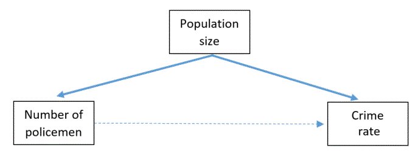

```{r, echo = FALSE, results = "hide"}
include_supplement("Capture.gif")
```

Question
========
Imagine we found a strong positive correlation between the number of
policemen and the crime rate in the same area. We might hypothesize that
this relationship is explained by the population size of this area. What
type of research design describes this best?

Answerlist
----------
* Spurious correlation with the crime rate as the dependent variable,
  population size as a spurious variable and the number of policemen as
  the independent variable
* Mediation with the crime rate as the dependent variable, population size
  as a spurious variable and the number of policemen as the independent
  variable
* Mediation with the number of policemen as the dependent variable,
  population size as a spurious variable and  crime rate  as the
  independent variable
* Spurious correlation with the number of policemen as the dependent
  variable, population size as a spurious variable and  crime rate  as the
  independent variable

Solution
========


This is an example of a spurious correlation where the crime rate as
dependent variable, population size as spurious variable and the number
of policemen as independent variable. The path diagram below illustrates
this.  



Answerlist
----------
* True
* False
* False
* False

Meta-information
================
exname: vufsw-correlations-1030-en
extype: schoice
exsolution: 1000
exshuffle: TRUE
exsection: inferential statistics/parametric techniques/correlations
exextra[Type]: test choice
exextra[Program]: NA
exextra[Language]: english
exextra[Level]: statistical reasoning

