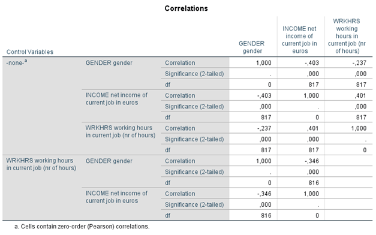

```{r, echo = FALSE, results = "hide"}
include_supplement("1605614559401.png", recursive = TRUE)
```

Question
========
In the partial correlation matrix below, including zero-order correlations, we examined the relationship between gender and income and whether this relationship changes when holding the number of working hours constant. There is Y = income (INCOME: a higher score means a higher earned income), X = sex (GENDER: 0 = male; 1 = female), and the variable (Z) held constant in the lower part of the matrix is labor hours (WRKHRS: number of hours per week spent in labor).  
  

  
How should we interpret the correlation of -.346 substantively?

Answerlist
----------
* The higher the income, the less the number of hours worked, where sex is held constant.
* The more hours worked, the higher the income, with sex held held constant.
* Women have lower income than men, when men and women with the same number of working hours are compared.
* Women work fewer hours than men, when men and women with the same income are compared.

Solution
========

Answerlist
----------
* False
* False
* True
* False

Meta-information
================
exname: vufsw-correlations-1295-en
extype: schoice
exsolution: 0010
exshuffle: TRUE
exsection: inferential statistics/parametric techniques/correlations
exextra[ID]: adc16
exextra[Type]: interpreting output
exextra[Program]: NA
exextra[Language]: English
exextra[Level]: statistical literacy

