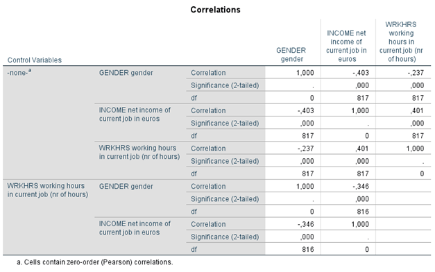

```{r, echo = FALSE, results = "hide"}
include_supplement("1605614559401.png")
```

Question
========
In de onderstaande partiële correlatiematrix, inclusief zero-order
correlaties, is het verband tussen sekse en inkomen onderzocht en of
deze relatie verandert wanneer je het aantal arbeidsuren constant houdt.
Er geldt Y = inkomen (INCOME: een hogere score betekent een hoger
inkomen uit arbeid), X = sekse (GENDER: 0 = man; 1 = vrouw), en de
variabele (Z) die constant gehouden wordt in het onderste deel van de
matrix is arbeidsuren (WRKHRS: aantal uren per week besteed aan
arbeid).  
  
  
  
Hoe moeten we de correlatie van -.346 inhoudelijk interpreteren?

Answerlist
----------
* Hoe hoger het inkomen, des te minder het aantal uren dat gewerkt wordt,
  waarbij sekse constant is gehouden.
* Hoe meer uren gewerkt worden, des hoger het inkomen, waarbij sekse
  constant is gehouden.
* Vrouwen hebben een lager inkomen dan mannen, wanneer mannen en vrouwen
  met hetzelfde aantal arbeidsuren worden vergeleken.
* Vrouwen werken minder uren dan mannen, wanneer mannen en vrouwen met
  hetzelfde inkomen worden vergeleken.

Solution
========


Answerlist
----------
* False
* False
* True
* False

Meta-information
================
exname: vufsw-correlations-1295-nl
extype: schoice
exsolution: 0010
exshuffle: TRUE
exsection: inferential statistics/parametric techniques/correlations
exextra[Type]: interpreting output
exextra[Program]: NA
exextra[Language]: dutch
exextra[Level]: statistical literacy

