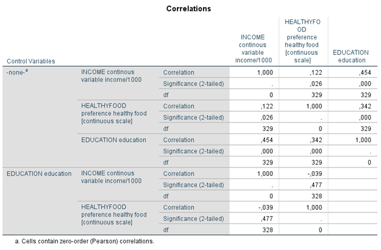
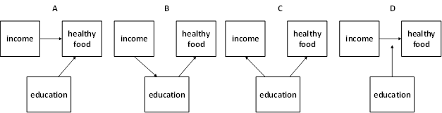

```{r, echo = FALSE, results = "hide"}
include_supplement("1605617449406.png", recursive = TRUE)
include_supplement("1605617642249.png", recursive = TRUE)
include_supplement("1606486551882.png", recursive = TRUE)
```

Question
========

  
In the partial correlation matrix below, including zero-order correlations, we examined the extent to which preference for healthy foods, such as granola or fish (HEALTHYFOOD), is correlated with education (EDUCATION) and income (INCOME). The data are from representative survey data among people between the ages of 20 and 40. Education is measured as last attained or current level of education (1-7: a higher score means a higher level of education). Income is measured in euros per month. The assumption is that education in causal order precedes income. Healthy eating (HEALTHYFOOD) is a continuous scale from 0 to 1.  
  
  

  
Which causal model best applies to the results of the partial correlation analysis?  
  


Answerlist
----------
* Model A
* Model B
* Model C
* Model D

Solution
========

Answerlist
----------
* False
* False
* True
* False

Meta-information
================
exname: vufsw-correlations-1297-en
extype: schoice
exsolution: 0010
exshuffle: TRUE
exsection: inferential statistics/parametric techniques/correlations
exextra[Type]: interpreting output
exextra[Program]: NA
exextra[Language]: English
exextra[Level]: statistical reasoning

