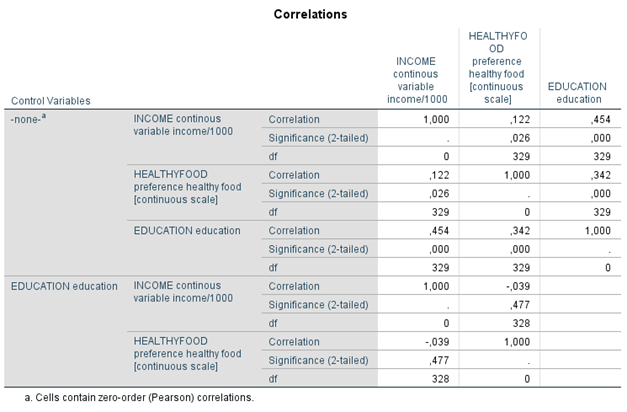

```{r, echo = FALSE, results = "hide"}
include_supplement("1605617449406.png", recursive = TRUE)
include_supplement("1605617642249.png", recursive = TRUE)
```

Question
========

  
In the partial correlation matrix below, including zero-order correlations, we examined the extent to which preference for healthy foods, such as granola or fish (HEALTHYFOOD), is correlated with education (EDUCATION) and income (INCOME). The data are from representative survey data among people between the ages of 20 and 40. Education is measured as last attained or current level of education (1-7: a higher score means a higher level of education). Income is measured in euros per month. The assumption is that education in causal order precedes income. Healthy eating (HEALTHYFOOD) is a continuous scale from 0 to 1.  
  
  

  
  
Education was measured on a scale of 1-7 and income in euros per month. What happens to the covariance and correlation if education and income were converted to z-scores?

Answerlist
----------
* Only the covariance changes
* Only the correlation changes
* Both the covariance and the correlation change
* Both the covariance and correlation do not change

Solution
========

Answerlist
----------
* True
* False
* False
* False

Meta-information
================
exname: vufsw-correlations-1298-en
extype: schoice
exsolution: 1000
exshuffle: TRUE
exsection: inferential statistics/parametric techniques/correlations
exextra[Type]: conceptual
exextra[Program]: NA
exextra[Language]: English
exextra[Level]: statistical literacy

