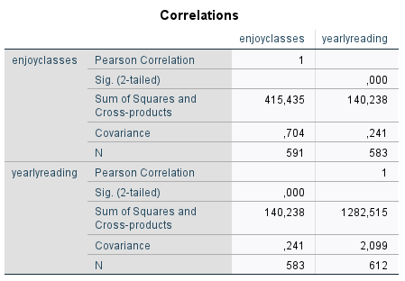

```{r, echo = FALSE, results = "hide"}
include_supplement("1631180281739.png")
```

Question
========
  
  
Leesfrequentie is gemeten in aantal gelezen boeken per jaar. Wat gebeurt
er met de covariantie en de correlatie als je lezen zou meten in aantal
gelezen boeken per maand?

Answerlist
----------
* Alleen de covariantie verandert
* Alleen de correlatie verandert
* Zowel de covariantie als de correlatie veranderen
* De covariantie en de correlatie veranderen beide niet

Solution
========


Answerlist
----------
* True
* False
* False
* False

Meta-information
================
exname: vufsw-covariance-1333-nl
extype: schoice
exsolution: 1000
exshuffle: TRUE
exsection: descriptive statistics/summary statistics/bivariate statistics/covariance
exextra[Type]: conceptual
exextra[Program]: NA
exextra[Language]: dutch
exextra[Level]: statistical literacy

