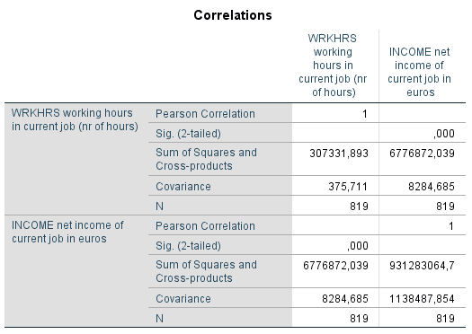

```{r, echo = FALSE, results = "hide"}
include_supplement("1602856060527.png", recursive = TRUE)
include_supplement("1602856133971.png", recursive = TRUE)
```

Question
========
 
  

  
Income is measured in euros per month. What happens to the covariance and correlation if income were measured in Japanese yen (1 euro = 123.243 yen)?

Answerlist
----------
* Only the covariance changes
* Only the correlation changes
* Both the covariance and the correlation change
* Both the covariance and correlation do not change

Solution
========

Answerlist
----------
* True
* False
* False
* False

Meta-information
================
exname: vufsw-covariance-1350-en
extype: schoice
exsolution: 1000
exshuffle: TRUE
exsection: descriptive statistics/summary statistics/bivariate statistics/covariance
exextra[ID]: 9cf82
exextra[Type]: conceptual
exextra[Program]: NA
exextra[Language]: English
exextra[Level]: statistical literacy

