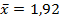
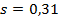
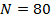

```{r, echo = FALSE, results = "hide"}
include_supplement("image001578cc6dc.gif", recursive = TRUE)
include_supplement("image002578cc6dc.gif", recursive = TRUE)
include_supplement("image003578cc6dc.gif", recursive = TRUE)
```

Question
========
Descriptive statistics of a variable look like the following:  
  



  
Which of the following statements about the empirical rule ("Empirical Rule") is correct? If the data is normally distributed, then approximately that ...

Answerlist
----------
* 95% of the sample averages are between 1.30 and 2.54
* 95% of the standard deviations are between 0.28 and 0.34.
* 95% of the standard errors are between 0.28 and 0.34.
* 95% of the observations are between 1.30 and 2.54.
* 95% of z-scores are between 1.30 and 2.54.

Solution
========

The empirical rule is a statistical rule which states that for a normal distribution, almost all data will fall within three standard deviations of the mean. Broken down, the empirical rule shows that 68% will fall within the first standard deviation, 95% within the first two standard deviations, and 99.7% will fall within the first three standard deviations of the distribution's mean.

Answerlist
----------
* False
* False
* False
* True
* False

Meta-information
================
exname: vufsw-empiricalrule-0012-en
extype: schoice
exsolution: 00010
exshuffle: TRUE
exsection: distributions/continuous/normal
exextra[Type]: conceptual
exextra[Program]: NA
exextra[Language]: English
exextra[Level]: statistical literacy

