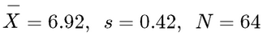

```{r, echo = FALSE, results = "hide"}
include_supplement("1641291066836.png", recursive = TRUE)
```

Question
========
A commercial was submitted for review to a group of Communication scholars. They had to assess the persuasiveness of the commercial on a number of indicators, which were aggregated to a scale of 1 to 10. It was found that the distribution of this variable is approximately normally distributed. The data looks as following (see bottom of question).  
According to the Empirical Rule, we can say about this data say that approximately....   


Answerlist
----------
* 68% of observations are between 6.71 and 7.13.
* 68% of observations are between 6.87 and 6.97.
* 95% of observations are between 6.82 and 7.03.
* 95% of observations are between 6.08 and 7.76.

Solution
========

Language Dutch

M&T Basics of quantitative research Basics of quantitative research

M&T BIS Default value
Answerlist
----------
* False
* False
* False
* True

Meta-information
================
exname: vufsw-empiricalrule-0027-en
extype: schoice
exsolution: 0001
exshuffle: TRUE
exsection: distributions/continuous/normal
exextra[ID]: 24351
exextra[Type]: conceptual
exextra[Program]: NA
exextra[Language]: English
exextra[Level]: statistical literacy

