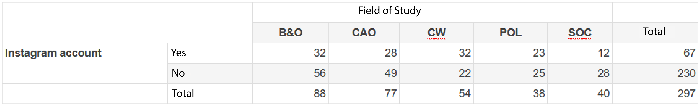

```{r, echo = FALSE, results = "hide"}
include_supplement("1641901027144.png", recursive = TRUE)
```

Question
========
A student at VU conducted research on the use of social media among FSW students. For her thesis, she collected data on the use of Instagram of 297 students. In the table below, the students' field of study is plotted to whether they have an Instagram account.  
The student aims to describe the relationship between study orientation and use of Instagram using a figure to describe it. What type of figure is most appropriate for this purpose and why?   
  


Answerlist
----------
* A bar chart (*bar chart*), because study direction is a categorical variable.
* A bar chart (*bar chart*), because study direction is a discrete quantitative variable.
* A bar chart (*bar chart*), because study direction is a continuous quantitative variable.
* A histogram, because study direction is a categorical variable.
* A histogram, because study direction is a discrete quantitative variable. is.
* A histogram, because study direction is a continuous quantitative variable. is.

Solution
========

Answerlist
----------
* True
* False
* False
* False
* False
* False

Meta-information
================
exname: vufsw-graphs-0097-en
extype: schoice
exsolution: 100000
exshuffle: TRUE
exsection: descriptive statistics/data representation/graphs
exextra[Type]: test choice
exextra[Program]: NA
exextra[Language]: English
exextra[Level]: statistical reasoning

