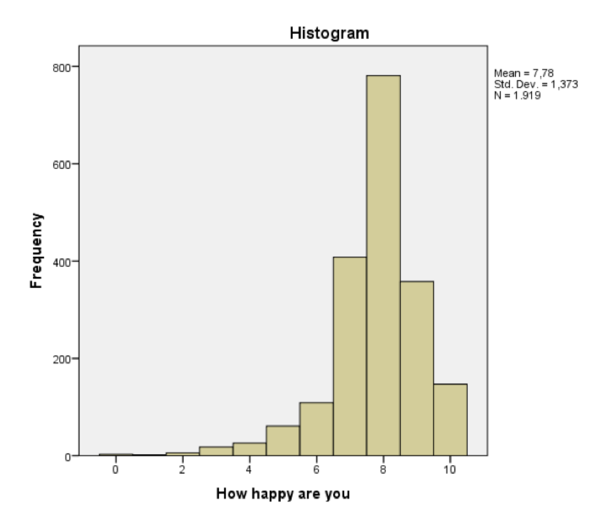

```{r, echo = FALSE, results = "hide"}
include_supplement("Screen__Shot__2019-02-21__at__00.20.09.png", recursive = TRUE)
```

Question
========
Below is the distribution of the happiness level of a random sample of 1919 Dutch people (source: European Social Survey, 2014). Respondents were asked the following question: "Overall, how happy would you say you are?" where the response options ranged between "very unhappy" (0) and "very happy" (10). Is this distribution right-skewed or left-skewed distribution? And how does the mean happiness level compare to the mode and the median?   
  


Answerlist
----------
* The distribution is left-skewed. The mean happiness level is lower than the mode and lower than the median.
* The distribution is left-skewed. The mean happiness level is lower than the mode, but higher than the median.
* The distribution is right-skewed. The mean happiness level is lower than the mode, but higher than the median.
* The distribution is right-skewed. The mean happiness level is lower than the mode and lower than the median.

Solution
========

Language Dutch

M&T Basics of quantitative research Basics of quantitative research

M&T BIS Default value
Answerlist
----------
* True
* False
* False
* False

Meta-information
================
exname: vufsw-histogram-0013-en
extype: schoice
exsolution: 1000
exshuffle: TRUE
exsection: descriptive statistics/data representation/graphs/histogram
exextra[ID]: 7401e
exextra[Type]: conceptual
exextra[Program]: NA
exextra[Language]: English
exextra[Level]: statistical literacy

