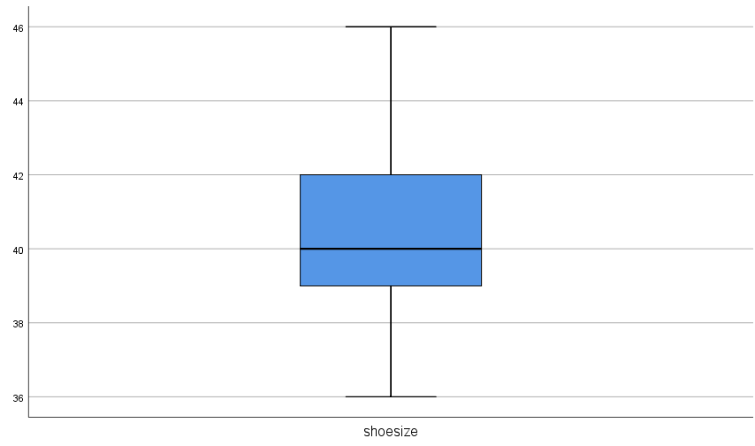

```{r, echo = FALSE, results = "hide"}
include_supplement("1580470436317.png", recursive = TRUE)
```

Question
========
Een nieuwsgierige onderzoeker vroeg een steekproef van studenten in een online vragenlijst naar hun schoenmaat. De boxplot hieronder toont de antwoorden.  
Wat was (ongeveer) het interkwartielbereik op basis van de boxplot?  
  


Answerlist
----------
* 1 schoenmaat
* 2 schoenmaten
* 3 schoenmaten
* 8 schoenmaten
* 4 schoenmaten

Solution
========

Het is 3: van 39 - 42 De **interkwartielafstand** is een maat voor waar de middelste vijftig[](https://www.statisticshowto.datasciencecentral.com/middle-fifty/) is in een gegevensreeks. Waar een bereik[ ](https://www.statisticshowto.datasciencecentral.com/probability-and-statistics/statistics-definitions/range-statistics/)is een maatstaf voor waar het begin en het einde in een verzameling liggen, **een Het interkwartielbereik geeft aan waar het grootste deel van de waarden ligt. Daarom heeft het de voorkeur boven veel andere maten van spreiding[](https://www.statisticshowto.datasciencecentral.com/measures-of-spread/) (d.w.z. het gemiddelde van mediaan)[](https://www.statisticshowto.datasciencecentral.com/average/)[](https://www.statisticshowto.datasciencecentral.com/probability-and-statistics/statistics-definitions/median-formula/) bij het rapporteren van zaken als schoolprestaties of SAT-scores. De interkwartielbereikformule is het eerste kwartiel afgetrokken van het derde kwartiel: 
* IQR = Q<sub>3</sub> - Q<sub>1</sub>.**

Taal Engels

Moeilijkheidsniveaus Gemakkelijk

M&T Grondbeginselen van kwantitatief onderzoek Grondbeginselen van kwantitatief onderzoek

M&T BIS Standaardwaarde

M&T Beschrijvende statistiek Standaardwaarde

M&T Verdelingen Standaardwaarde
Answerlist
----------
* Onwaar
* Onwaar
* Waar
* Onwaar
* Onwaar

Meta-information
================
exname: vufsw-interquartilerange-1083-nl
extype: schoice
exsolution: 00100
exshuffle: TRUE
exsection: descriptive statistics/summary statistics/measures of spread/interquartile range/ boxplot
exextra[ID]: b9cef
exextra[Type]: interpretating output
exextra[Program]: calculator
exextra[Language]: Dutch
exextra[Level]: statistical literacy

